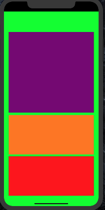
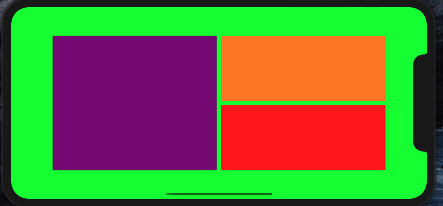

# Size Classes and Trait Collecitons

Implements a trait colleciton change using constraints. 

### Prerequisites

iOS 13.2+
Swift 5+
Xcode 11+

## Contributing

Please read [CONTRIBUTING.md](https://gist.github.com/PurpleBooth/b24679402957c63ec426) for details on our code of conduct, and the process for submitting pull requests to us.

## Versioning

1.0

## Authors

* **Arturo Arriaga** - *Initial work* - [ArturoArriaga](https://github.com/ArturoArriaga)

## License

This project is licensed under the MIT License - see the [LICENSE.md](LICENSE.md) file for details

